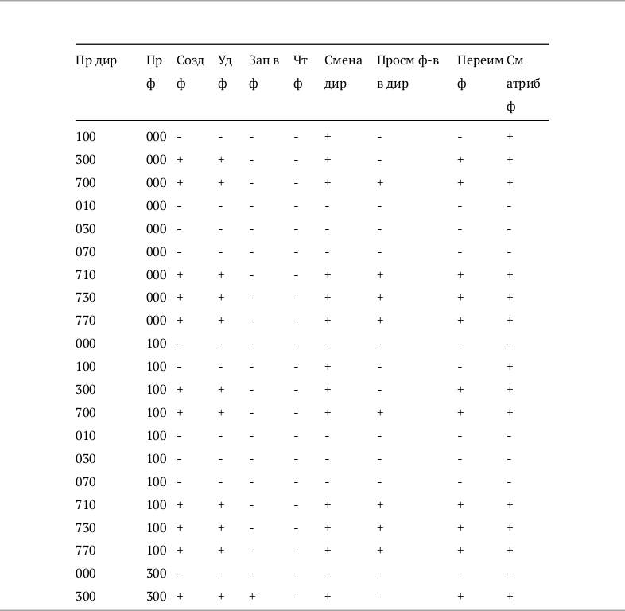
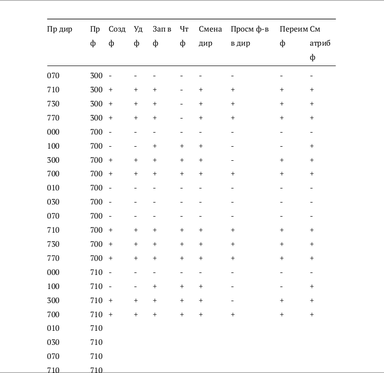
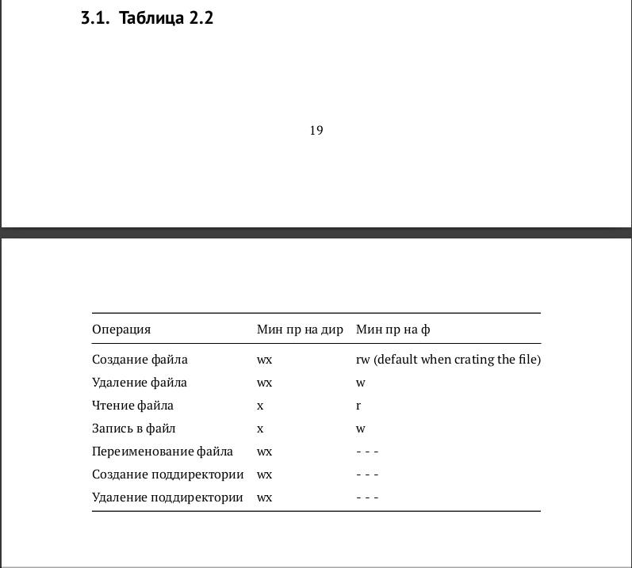

---
## Front matter
lang: ru-RU
title: Лабораторная работа №2
author: |
	 Алли Мохамед Заян - студент группы НКНбд-01-18
date: 1.10.2021

## Formatting
toc: false
slide_level: 2
theme: metropolis
header-includes:
 - \metroset{progressbar=frametitle,sectionpage=progressbar,numbering=fraction}
 - '\makeatletter'
 - '\beamer@ignorenonframefalse'
 - '\makeatother'
aspectratio: 43
section-titles: true
---

# Дискреционное разграничение прав в Линукс. Основные атрибуты.

## Прагматика выполнения

- Умение пользоваться базовыми командами разграничения прав в системе Linux CentOS

## Цель выполнения лабораторной работы

Научиться пользоваться базовыми командами разграничения прав в системе Linux CentOS.

## Задачи выполнения работы

- Выполнение пунктов по исполнению команд.
- Составление таблиц с правами.

## Результаты выполнения лабораторной работы. Часть 1

Заполнил таблицу 2.1

{ #fig:001 width=70% }

{ #fig:002 width=70% }

## Часть 2

Заполнил таблицу 2.2.

{ #fig:003 width=70% }

## Выводы

Получил практические навыки работы в консоли с атрибутами файлов, закрепил теоретические основы дискреционного разграничения доступа в современных системах с открытым кодом на базе ОС Linux.

Замечание: Вероятно, таблица, которую я составил, неверна. Я принял, что можно менять значения и администратора и группы. Тогда имеем 64 варианта для файла и 64 варианта для группы, итого 512 вариантов, что, конечно же, не является ожидаемым результатом.  
Нужно было менять значения только для администратора. Тогда имеем 8 вариантов для папки, и для файла. Учитывая, что мы должны рассмотреть все варианты, имеем 64 варианта, как и указано в задании.
